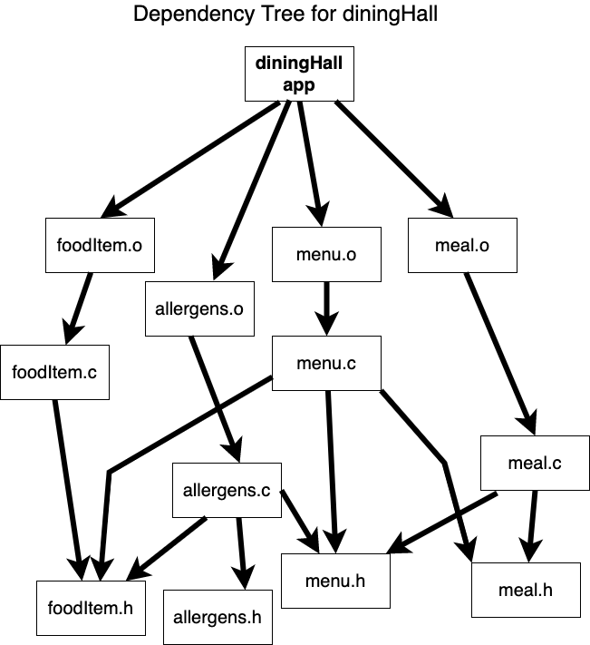

# Activity: Can you make it?

Reminder: use ‘make -n’ to see what make will do without actually doing it,  and use  ‘touch’ to make specific files out of date.

---

1. Build an initial makefile based on the dependency diagram below. Be sure to use variables (like `$(OBJS)`) when you can. .
2. add macros for `gcc`,  `-Wall -pedantic -std=c11 -ggdb`, and library flags (e.g., `-lm`).
3. add target `clean:` that erases the app, `.o`, and other files that could result from a run of `make`.  
4. test your makefile to ensure the dependency tree is correctly represented.  For example:
- run `make clean` then `make` to build everything. Then `touch meal.h` and then `make` and you should only see `menu.c` and `meal.c` recompiled.

5. add a target `test:` that depends on the supplied `testing.sh` and the app (i.e., `diningHall`).
6. add target `backup`: target that makes `clean` and then creates a backup tarfile of your .c and .h files (e.g., `tar -cvf ../backup.tar *.c *.h`).  Be sure to add an exception to the `clean:` for your `backup*.tar` files!
7. add a `backup:` target to check whether `../backup.tar` already exists and, if it does, renames it to `../backup-previous.tar`. If the `../backup-previous.tar` file already exists just overwrite it.
8. add a target `submit:` that depends on the `clean` target and then rebuilds the app _without_ the `-ggdb` option as its "recipe".

## Challenge

How would you modify the `Makefile` if each individual `.c` file was in its own directory?  Hint: read about the `-C` option of  `make` in its man page (i.e., `man make`).

---

Put your answers and resulting Makefile in a Markdown file and upload it to Canvas 
for Activity8. You can copy the Makefile contents into the Markdown file inside a 
code block (```` ``` ... ``` ````). 
